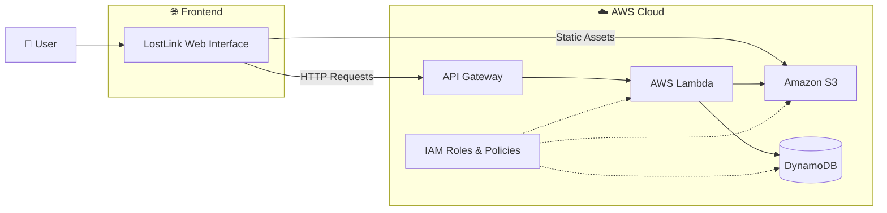

# 🔍 LostLink – Smart Lost and Found Portal

LostLink is a smart cloud-based Lost and Found Portal designed to simplify the process of reporting, searching, and managing lost and found items.

The platform provides a centralized system where users can report lost or found items and search for potential matches efficiently.

---

## 📸 Screenshots

### 🌐 LostLink Web Interface


### 🔍 Item Search and Reporting


---

## 🚀 Features

* Report lost and found items
* Search and browse reported items
* Centralized cloud-based data storage
* Responsive and user-friendly interface
* Scalable serverless backend architecture

## ☁️ AWS Services Used

* **Amazon S3** – Stores static website assets and uploaded files
* **AWS Lambda** – Executes backend business logic without managing servers
* **Amazon API Gateway** – Exposes REST APIs for frontend communication
* **Amazon DynamoDB** – Stores lost and found item records
* **AWS IAM** – Manages secure permissions and access between AWS services

## 🛠️ Technologies Used

* HTML5
* CSS3
* JavaScript
* AWS Lambda
* Amazon API Gateway
* Amazon DynamoDB
* Amazon S3
* AWS IAM

## 🏗️ System Architecture



## 🔄 Application Workflow

```text
User
  │
  ▼
LostLink Web Interface
  │
  ▼
Amazon API Gateway
  │
  ▼
AWS Lambda
  │
  ├──────────────► Amazon DynamoDB
  │                └── Lost & Found Item Data
  │
  └──────────────► Amazon S3
                   └── Uploaded Files / Assets
```

## 📁 Project Structure

```text
LostLink-Smart_Lost_and_Found_Portal/
│
├── index.html
├── style.css
├── script.js
│
└── README.md
```

## 🎯 Objective

The goal of LostLink is to provide a simple, efficient, and scalable platform that helps people reconnect with their lost belongings through a centralized cloud-based system.

## 👨‍💻 Author

**Janhavi Patil**
